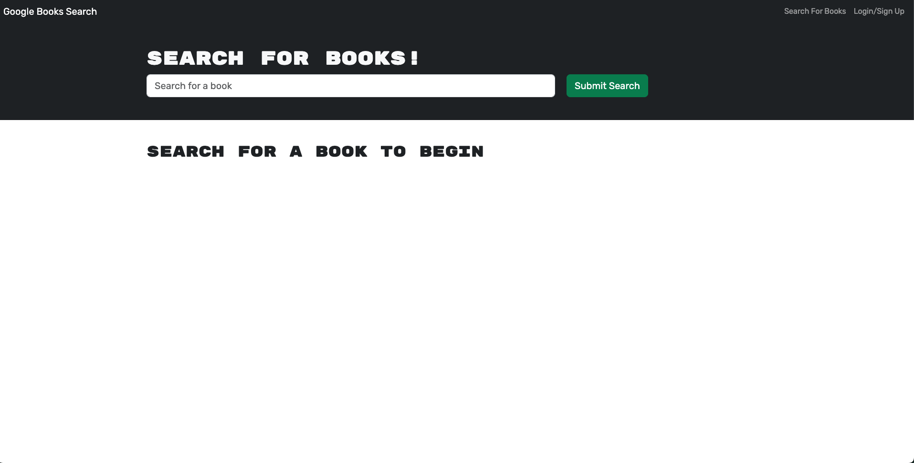

# MERN-Book-Search-Engine

## Description

Given a full functioning Book Search Engine built with a RESTful API, I have refactored it to use GraphQL API. 

## Table of Contents

  - [Installation](#installation)
  - [Usage](#usage)
  - [Credits](#credits)

## Installation

No installation necessary. You can view the application [here](https://mern-graphql-book-search-939e16c89a4a.herokuapp.com/)

## Usage

When the user opens the web application they can see the homepage where they can search for books. 

 

If the user is not signed in they will be unable to interact with any of the books. If however, the user is logged in, they will see a button to save the book. Once clicked they will see the button change to let them know they have already saved the book.

The user can then click on the 'See your books' nav item where they can view all their saved books, as well as delete any books they wish with the 'delete book' button under each book they have saved.

 

## Credits

AskBcS and Jack Song for help.

Starter code provided by Monash Bootcamp: https://git.bootcampcontent.com/Monash-University/MONU-VIRT-FSF-PT-02-2023-U-LOLC/-/tree/main/Week-21/02-Challenge
